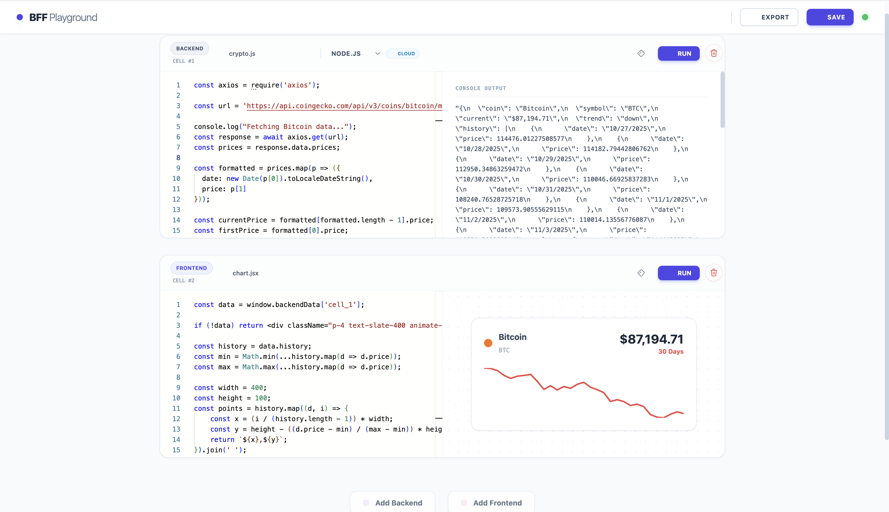
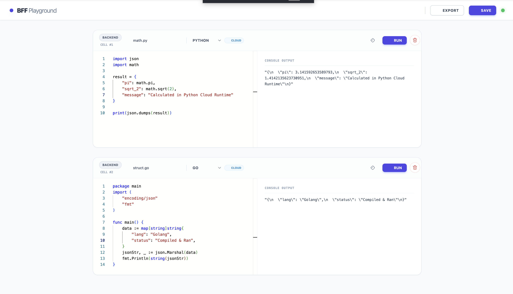
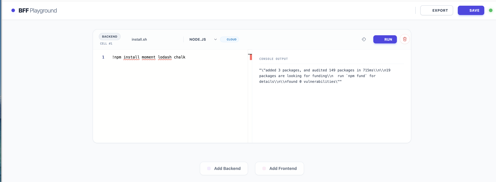
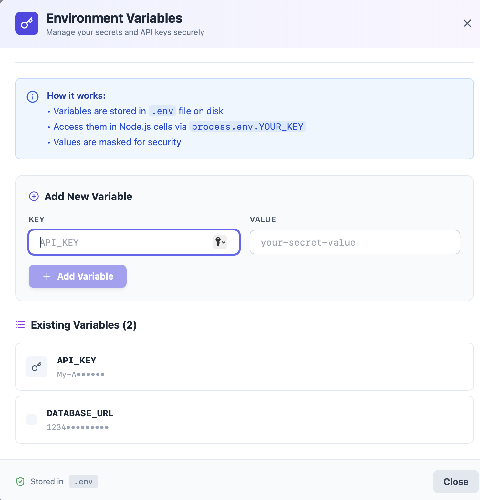
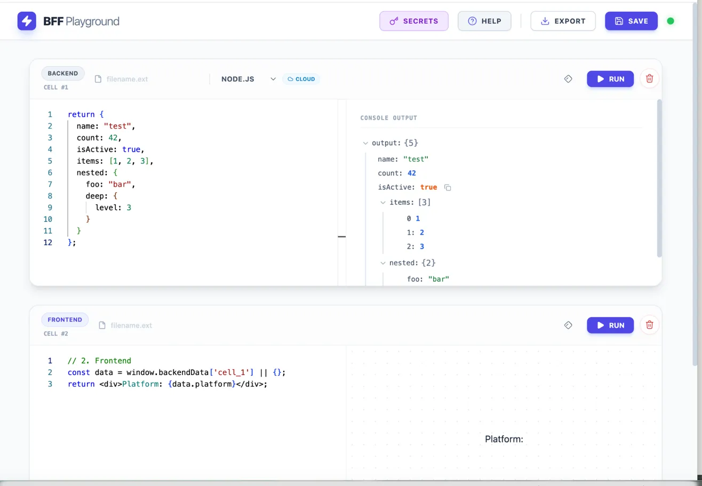
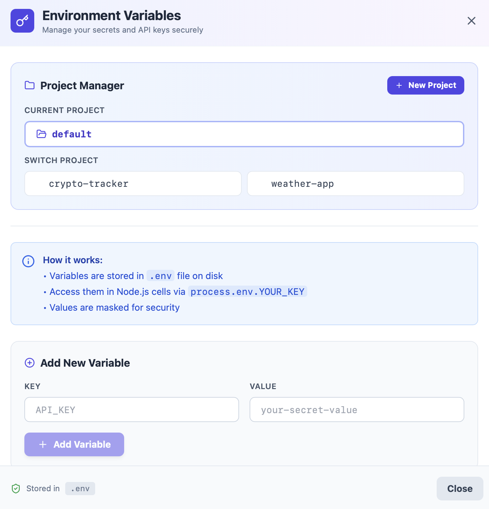
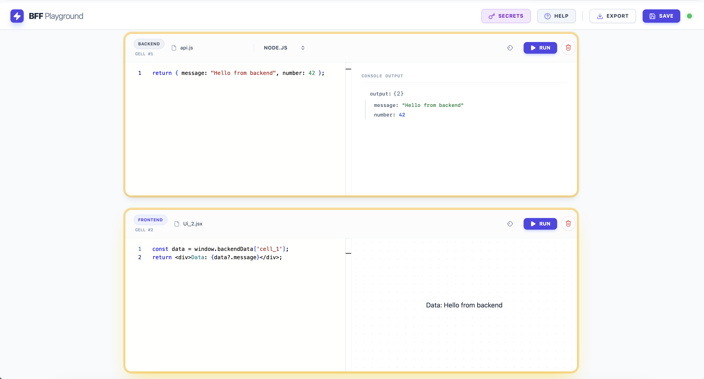

# BFF Playground
>
> A local-first, reactive notebook for building full-stack features in a single view.



**BFF Playground** bridges the gap between backend logic and frontend UI. It allows you to write Node.js, Python, or Go backend code in one cell and immediately consume that data in a React frontend cell, all within the same reactive environment.

## Features

### 1. Hybrid Runtime Architecture
* **Local Node.js:** Runs directly on your machine. Full access to your **File System**, **Databases**, and **Local Network**.
* **Cloud Polyglot:** Execute Python, Go, Rust, Java, and PHP via the Piston API in a secure sandbox.

### 2. Reactive Data Graph
Just like a spreadsheet, when your Backend Cell finishes execution, any dependent Frontend Cells automatically re-render with the new data. No manual refresh required.



### 3. Magic Shell (`!`)
Need a library? You don't need to leave the browser. Just type `!npm install` in a backend cell to install packages on the fly.



### 4. Professional Developer Experience
* **Monaco Editor:** The same editor engine as VS Code.
* **Persistence:** Your code is auto-saved to `playground.json`.
* **Export:** One-click export to generate valid `.js`, `.jsx`, and `.py` source files.

### 5. Secure Environment Variables Manager
Manage API keys, database credentials, and secrets through an intuitive UI—no more hardcoding sensitive data!



* **Visual Secret Management:** Add, view, and delete environment variables via the "Secrets" button.
* **Secure Storage:** All secrets stored in .env file (gitignored by default).
* **Instant Access:** Use process.env.YOUR_KEY in any Node.js cell.
* **Masked Display:** Values are hidden for security.
* **No Manual Editing:** Never touch .env files directly.

* **Example Usage**
    ```bash
    // Add API_KEY via Secrets UI, then access it:
    const apiKey = process.env.API_KEY;
    const response = await fetch('https://api.example.com', {
        headers: { 'Authorization': `Bearer ${apiKey}` }
    });
    ```

### 6. Interactive JSON Tree View
Debug complex API responses and nested objects with an intuitive, collapsible tree viewer that makes data exploration effortless.



* **Collapsible Structures:** Expand/collapse objects and arrays with chevron icons for clean, organized viewing.
* **Syntax Highlighting:** Color-coded primitives for instant type recognition:
  * Strings in green
  * Numbers in blue
  * Booleans in orange
  * Null values in purple
* **Smart Defaults:** Top-level objects auto-expand for immediate visibility, deeply nested structures start collapsed.
* **Memory Efficient:** Handles large datasets without performance degradation.

### 7. Multi-Project Support
Work on multiple experiments simultaneously without data conflicts. Each project maintains its own isolated workspace with independent cells and configurations.



* **Named Projects:** Create distinctly named workspaces (e.g., `crypto-tracker`, `weather-app`, `todo-list`).
* **Seamless Switching:** Toggle between projects without restarting the server—your work is preserved.
* **Isolated Storage:** Each project saves to its own `{name}.playground.json` file.
* **Visual Project Manager:** Intuitive UI in the Environment Variables modal for creating and switching projects.
* **Zero Data Loss:** Switch contexts freely—all cells, code, and outputs remain intact per project.
* **Backward Compatible:** Existing `playground.json` automatically migrates to `default.playground.json`.

* **Example Workflow:**
```bash
    1. Create "crypto-tracker" project → Build crypto price dashboard
    2. Create "weather-app" project → Build weather API integration
    3. Switch between them instantly without losing any work
```

### 8. Visual Dependency Highlighting
Understand your data flow at a glance with interactive cell relationship visualization. No more guessing which cells depend on each other.



* **Hover to Reveal:** Mouse over any cell to instantly highlight its dependencies.
* **Bidirectional Links:** 
  * Hover Backend Cell → Highlights all Frontend cells consuming its data
  * Hover Frontend Cell → Highlights the Backend cells it reads from
* **Visual Feedback:** Amber glow effect clearly indicates active relationships.
* **Zero Configuration:** Automatically detects dependencies by analyzing `window.backendData` references.
* **Multi-Dependency Support:** Frontend cells using multiple backend sources show all connections simultaneously.

* **Example Workflow:**
```javascript
    // Backend Cell #1: User data
    return { name: "Alice", age: 25 };
    
    // Backend Cell #2: Location data
    return { city: "New York" };
    
    // Frontend Cell: Consumes both
    const user = window.backendData['cell_1'];
    const loc = window.backendData['cell_2'];
    // Hovering this cell highlights BOTH backend cells!
```
---

## Installation

1.  **Clone the repository**
    ```bash
    git clone [https://github.com/VS251/bff-playground.git]
    cd bff-playground
    ```

2.  **Install dependencies**
    ```bash
    npm install
    ```

3.  **Start the Bridge Server**
    ```bash
    npm start
    ```
    *(Or run `node bridge.js` if you haven't set up the start script)*

4.  **Open the Playground**
    Visit `http://localhost:8080` (or open `index.html` directly in your browser).

---

## Important: Connectivity Rules

The playground uses a hybrid execution model with specific networking rules:

| Runtime | Environment | Internet Access | Use Case |
| :--- | :--- | :--- | :--- |
| **Node.js** | Local Machine | ✅ **Yes** | Fetching APIs, Database queries, File I/O |
| **Python** | Cloud Sandbox | ❌ **No** | Data processing, Algorithms, Logic |
| **Go / Rust** | Cloud Sandbox | ❌ **No** | High-performance logic testing |

*If you need to fetch data from an external API (e.g., Weather, Crypto), you **must** use a Node.js cell.*

---

## License

MIT